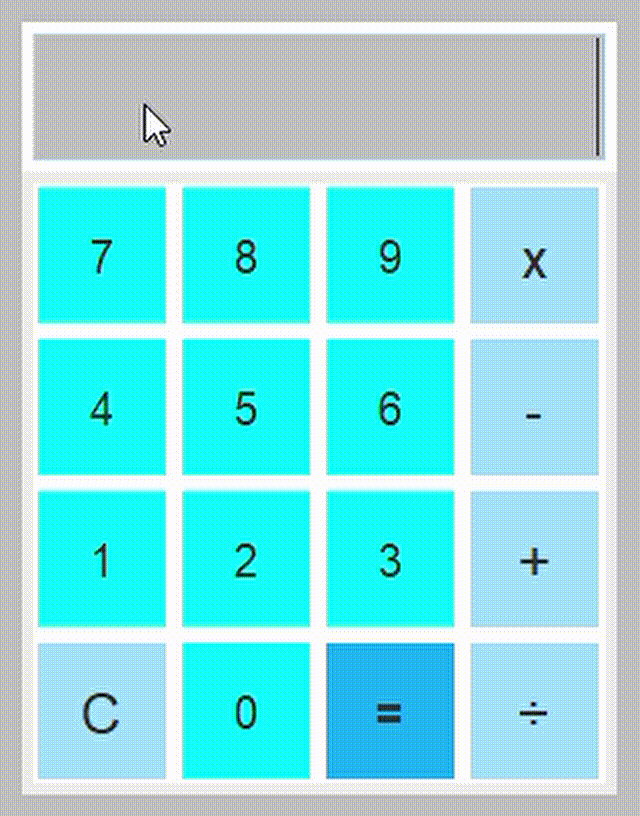

# Calculadora Gráfica con Java Swing

## Descripción
Este proyecto es una **calculadora gráfica** implementada en Java utilizando la librería **Swing** para la interfaz gráfica. La calculadora permite realizar operaciones básicas como suma, resta, multiplicación y división. La interfaz incluye botones estilizados para números, operadores y un display para mostrar los cálculos y resultados.

---

## Características
- **Operaciones soportadas**:
  - Suma (+)
  - Resta (-)
  - Multiplicación (x)
  - División (÷)
- Soporte para números negativos.
- Manejo básico de errores como divisiones por cero y entradas no válidas.
- Diseño amigable y botones codificados por color según su función:
  - **Números**: Fondo azul claro.
  - **Operadores**: Fondo celeste.
  - **Igual (=)**: Fondo azul oscuro.
- Botón de reinicio ("C") para borrar el display y restablecer los valores.

---

## Requisitos
- **Java Development Kit (JDK)** 8 o superior.
- Un entorno de desarrollo integrado (IDE) como Eclipse, IntelliJ IDEA, o simplemente un editor de texto con compilación manual.

---

## Estructura del Código
### Clases y Objetos Principales
- **`Engine`**: La clase principal que hereda de `JFrame` y contiene la lógica y diseño de la calculadora.

### Componentes Principales
- **Ventana principal (`JFrame`)**: Marco de la aplicación.
- **Paneles (`JPanel`)**:
  - `contentPanel`: Panel principal que contiene todos los elementos.
  - `displayPanel`: Panel superior para el display.
  - `buttonPanel`: Panel que organiza los botones en un formato de cuadrícula.
- **Display (`JTextField`)**: Campo de texto donde se muestran las operaciones y resultados.
- **Botones (`JButton`)**: Representan los números, operadores y acciones especiales (igual y reinicio).

### Enumeración
- **`ButtonType`**: Define los tipos de botones (números, operadores y el botón igual).

### Métodos Importantes
- `setSettings()`: Configura los ajustes de diseño y estilo de la ventana y sus componentes.
- `setFeaturesButton(JButton _button, ButtonType _type)`: Aplica estilos específicos a los botones según su tipo.
- `addActionEvent(Engine engine)`: Asocia eventos de clic a los botones.
- `actionPerformed(ActionEvent e)`: Maneja las acciones realizadas por el usuario (clic en botones).
- `operation()`: Realiza las operaciones matemáticas.

---

## Uso
1. Compila el archivo `Engine.java`:
   ```bash
   javac Engine.java
   ```
2. Ejecuta el programa:
   ```bash
   java Engine
   ```
3. Interactúa con la interfaz gráfica:
   - Ingresa números y operaciones utilizando los botones.
   - Presiona "=" para calcular el resultado.
   - Usa "C" para limpiar el display.





---

## Personalización
- **Colores y Fuentes**:
  Puedes modificar los colores y fuentes de los botones y el display ajustando las propiedades en los métodos `setFeaturesButton` y `setSettings`.
  
- **Nuevas Funcionalidades**:
  Si deseas agregar nuevas operaciones (por ejemplo, potencias o raíces), puedes extender el método `operation()` y ajustar los eventos en `actionPerformed`.

---

## Manejo de Errores
- **División por cero**: Muestra el mensaje "Err div x 0".
- **Entradas no válidas**: Muestra el mensaje "Error".
  
---

## Autor
Desarrollado como un ejemplo de uso práctico de Java Swing para crear interfaces gráficas interactivas.

